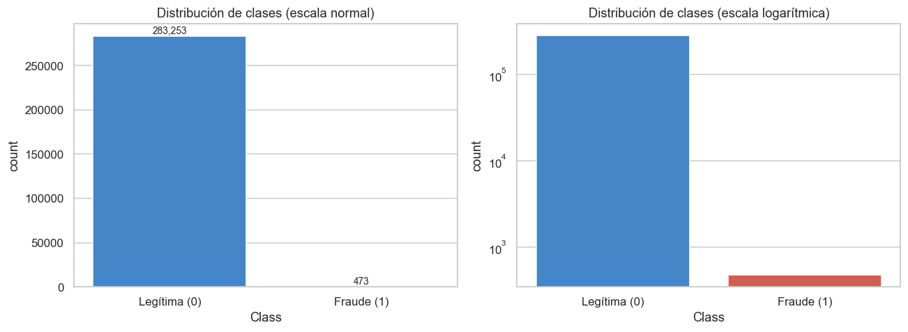
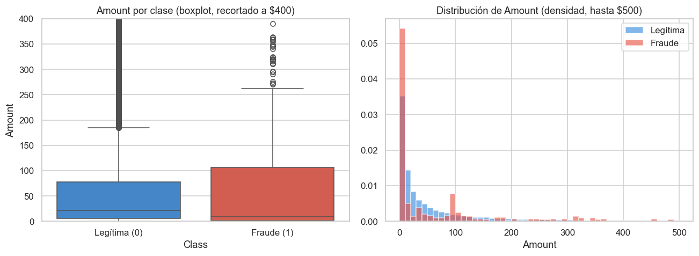
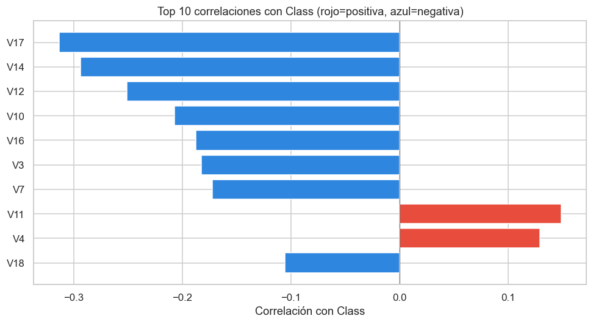

# Hallazgos Clave del Dataset — Fase 1 (Data)

**Proyecto MLOps — Detección de Fraude con Tarjetas de Crédito**
**Fase 1 (EDA) · Responsable: Integrante 1 · Revisa: Integrante 4**

> Este documento contiene la **interpretación y los hallazgos** derivados del
> notebook [`deteccion_fraude_mlops.ipynb`](../deteccion_fraude_mlops.ipynb).
> Se entrega **junto con ese notebook** a quien continúe con la Fase 2
> (Modeling), para que no tenga que re-explorar los datos.
> Las decisiones de diseño transversales del equipo están en el
> [README principal](../README.md).

---

## 1. Descripción y calidad de los datos

- **Tamaño original:** 284,807 transacciones × 31 columnas (`Time`, `V1`–`V28`,
  `Amount`, `Class`).
- **Valores nulos:** **0**. El dataset está completo.
- **Filas duplicadas exactas:** **1,081** (0.380 % del total). Aunque el dataset
  suele describirse como "limpio", los duplicados existen y se demostraron con
  código (`df.duplicated().sum()`).
- **Tamaño tras eliminar duplicados:** **283,726 transacciones**. El resto del
  análisis se realiza sobre este conjunto sin duplicados.

**Hallazgo:** los duplicados son reales y deben eliminarse **antes** de dividir
train/test, para evitar que la misma transacción caiga en ambos conjuntos
(*data leakage*).

## 2. Distribución de la clase (el desbalance)

| Clase | Cantidad | Porcentaje |
|---|---|---|
| 0 — Legítima | 283,253 | **99.833 %** |
| 1 — Fraude | 473 | **0.167 %** |

- Relación aproximada: **1 fraude por cada ~598 transacciones legítimas**.

**Hallazgo (el más importante):** el problema es de **clasificación binaria
altamente desbalanceada**. Un modelo trivial que prediga "todo legítimo"
alcanzaría ~99.83 % de *accuracy* sin detectar un solo fraude → el **accuracy es
engañoso** y no debe usarse como métrica principal.

## 3. Distribución de `Amount` (monto) por clase

| Estadística | Legítima | Fraude |
|---|---|---|
| Media | ~$88 | ~$122 |
| Mediana | **~$22.00** | **~$9.25** |

**Hallazgo:** el comportamiento del monto difiere entre clases. El fraude tiene
una **mediana más baja** (la mayoría de fraudes son montos pequeños, quizá para
pasar desapercibidos), pero una **media más alta**, lo que indica la presencia
de algunos fraudes de monto elevado que estiran el promedio. `Amount` aporta
señal, aunque no es por sí sola un separador perfecto.

## 4. Correlación con el fraude

Top variables más correlacionadas con `Class` (en valor absoluto):

| Variable | Correlación con `Class` |
|---|---|
| V17 | −0.313 |
| V14 | −0.293 |
| V12 | −0.251 |
| V10 | −0.207 |
| V16 | −0.187 |
| V3  | −0.182 |
| V7  | −0.172 |
| V11 | +0.149 |
| V4  | +0.129 |
| V18 | −0.105 |

**Hallazgo:** las variables **V17, V14, V12, V10 y V16** son las más ligadas al
fraude (correlación negativa: valores bajos de estas variables tienden a
asociarse con fraude). Como `V1`–`V28` provienen de una PCA anonimizada, no se
puede interpretar su significado de negocio, pero sí sirven de guía sobre qué
variables aportan más señal. Ninguna correlación individual es muy alta, lo que
sugiere que hará falta un modelo que combine varias variables (no basta un
umbral simple sobre una sola).

---

## 5. Decisiones de datos (derivadas del EDA)

Estas decisiones las toma el Integrante 1 con base en los hallazgos anteriores y
las hereda la Fase 2.

### 5.1 Métrica de éxito
- **Principales: F1 y AUPRC.** Se reportan además **precision** y **recall** por
  separado (los usa el criterio de promoción de la Fase 3).
- **No usar accuracy** como métrica principal (justificado por el desbalance del
  0.167 %).

### 5.2 División train/test
- **75 % train / 25 % test, estratificado** por `Class`, con `random_state` fijo.
- La estratificación es obligatoria: con solo 473 fraudes, una división aleatoria
  simple podría dejar muy pocos en el test.
- La comparación entre modelos se hará con **validación cruzada estratificada
  dentro del train**; el test queda intacto hasta la evaluación final.

### 5.3 Balanceo de clases
- **NO** aplicar sobremuestreo sintético (SMOTE) ni submuestreo.
- Manejar el desbalance con **`class_weight='balanced'`** en los modelos, para
  no alterar los datos ni contaminar el test real.

### 5.4 Preprocesamiento pendiente para la Fase 2
- `V1`–`V28` ya están estandarizadas (vienen de PCA) → **no** requieren escalado.
- **`Amount` y `Time` NO están escaladas** → la Fase 2 debe escalarlas
  (se sugiere `RobustScaler` para `Amount`, por sus outliers).

---

## 6. Resumen para la Fase 2 (una línea)

> Dataset desbalanceado (0.167 % fraude, 283,726 filas sin duplicados), sin
> nulos, con `Amount`/`Time` por escalar y señal repartida entre varias
> variables PCA. Entrenar con split 75/25 estratificado, `class_weight`, y
> evaluar con F1/AUPRC (nunca accuracy).

---

*Los gráficos de soporte los genera el notebook y se guardan en esta misma
carpeta (`/reports`): `01_desbalance_clases.png`, `02_amount_por_clase.png`,
`03_matriz_correlacion.png`, `04_top_correlaciones.png`.*
