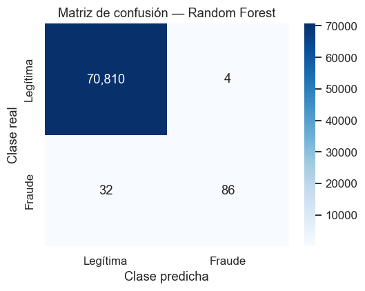
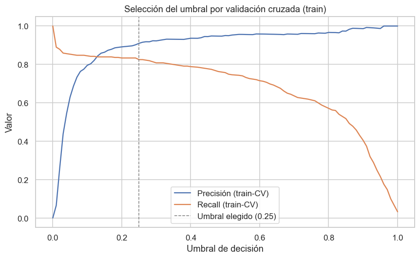

# Metodología y Resultados del Modelado — Fase 2 (Modeling)

**Proyecto MLOps — Detección de Fraude con Tarjetas de Crédito**
**Fase 2 (Modeling) · Responsable: Integrante 2 · Revisión: Integrante 3**

Este documento reúne la metodología de modelado y la interpretación de los
resultados obtenidos en el notebook
[`deteccion_fraude_mlops.ipynb`](../deteccion_fraude_mlops.ipynb), sección
"Fase 2". Se entrega junto con el notebook a quien continúe con la Fase 3
(instrumentación con MLflow). En esta fase el flujo aún no incorpora MLflow, de
acuerdo con la planificación del proyecto.

## 1. Preparación de los datos

Se parte del conjunto ya depurado en la Fase 1 (sin duplicados). Las decisiones
aplicadas son las acordadas previamente:

- División 75/25 estratificada por `Class`, con `random_state=42`. El
  entrenamiento queda con 212,794 registros (355 fraudes) y la prueba con
  70,932 registros (118 fraudes).
- Escalado de `Amount` y `Time` mediante `RobustScaler`, ajustado únicamente con
  el conjunto de entrenamiento para evitar fuga de información. Las variables
  `V1`–`V28` no se reescalan por provenir de una PCA.
- Tratamiento del desbalance con `class_weight='balanced'` en cada modelo, sin
  remuestreo sintético.

## 2. Esquema de evaluación

Para cada modelo se calculan el F1-score y el AUPRC por validación cruzada
estratificada de 5 particiones sobre el entrenamiento, y luego se reportan F1,
precisión, recall y AUPRC sobre el conjunto de prueba. La exactitud (accuracy)
se omite por el desbalance de clases.

## 3. Iteraciones e hipótesis

El modelado sigue un esquema iterativo: se parte de un modelo base y cada modelo
posterior responde a una hipótesis motivada por el resultado anterior.

| Iteración | Modelo | F1 (CV) | AUPRC (CV) | F1 (test) | Precisión (test) | Recall (test) | AUPRC (test) |
|---|---|---|---|---|---|---|---|
| Base | Regresión Logística | 0.108 | 0.754 | 0.104 | 0.055 | 0.890 | 0.676 |
| 1 | Random Forest | 0.837 | 0.841 | 0.827 | 0.956 | 0.729 | 0.806 |
| 2 | Gradient Boosting | 0.610 | 0.752 | 0.509 | 0.371 | 0.814 | 0.697 |

### 3.1 Modelo base — Regresión Logística

Responde a la pregunta de referencia: qué desempeño ofrece un clasificador
lineal simple. El modelo alcanza un recall alto (0.890), es decir, detecta la
mayoría de los fraudes, pero con una precisión muy baja (0.055): la gran mayoría
de las transacciones que marca como fraude son en realidad legítimas. El
F1-score resultante (0.104) es bajo. Este comportamiento evidencia que un modelo
lineal no separa adecuadamente ambas clases en este problema.

### 3.2 Iteración 1 — Random Forest

**Hipótesis:** un modelo capaz de captar relaciones no lineales mejorará el
equilibrio entre precisión y recall observado en el baseline.

**Resultado:** la hipótesis se confirma. El Random Forest eleva el F1-score de
prueba a 0.827 y el AUPRC a 0.806. La mejora es especialmente marcada en la
precisión (0.956), a costa de un recall algo menor (0.729) que el del baseline.
El modelo detecta una proporción alta de fraudes generando muy pocos falsos
positivos.

### 3.3 Iteración 2 — Gradient Boosting

**Hipótesis:** un método de boosting, al corregir secuencialmente los errores,
podría superar al Random Forest en la clase minoritaria.

**Resultado:** la hipótesis no se confirma con la configuración por defecto. El
Gradient Boosting obtiene un F1-score de prueba de 0.509 y un AUPRC de 0.697,
por debajo del Random Forest. Aunque su recall (0.814) supera al de este, su
precisión (0.371) es considerablemente menor, lo que reduce el desempeño global.
Un ajuste de hiperparámetros podría mejorar estos valores, pero con la
configuración base no supera a la iteración 1.

## 4. Selección del modelo

Se selecciona el **Random Forest** como modelo de la fase, por presentar el
mejor F1-score y el mejor AUPRC sobre el conjunto de prueba, además de una
precisión elevada que limita los falsos positivos. Su matriz de confusión se
muestra a continuación.

## 5. Ajuste del umbral de decisión

Con el umbral por defecto (0.5), el Random Forest cumple con holgura el umbral de
precisión del criterio de promoción (0.956) pero queda por debajo en recall
(0.729). Dado que el umbral es un parámetro operativo y no una propiedad fija del
modelo, se ajusta para trasladar el punto de operación hacia un mayor recall.

Para no sesgar la evaluación, el umbral se selecciona **únicamente con el conjunto
de entrenamiento**, mediante validación cruzada (probabilidades *out-of-fold*), y
se elige el que maximiza el F1. El conjunto de prueba no interviene en la
elección: se emplea solo para reportar el desempeño final con el umbral ya fijado.

El umbral seleccionado es **0.25**. Evaluado sobre el conjunto de prueba con ese
umbral fijado de antemano, el modelo obtiene:

| Punto de operación | Precisión | Recall | F1 | ¿Cumple criterio (R>0.75 y P>0.85)? |
|---|---|---|---|---|
| Umbral por defecto (0.50) | 0.956 | 0.729 | 0.827 | No |
| **Umbral seleccionado (0.25)** | **0.910** | **0.771** | **0.835** | **Sí** |

De esta manera el modelo cumple ambas condiciones del criterio de promoción sin
que los valores se fijen de forma arbitraria ni se ajuste el umbral observando el
conjunto de prueba.

## 6. Fundamentación en la literatura y la comunidad

Las decisiones de esta fase concuerdan con la literatura del área y con la
práctica de la comunidad sobre este mismo conjunto de datos:

- El AUPRC como métrica principal es la recomendación de los autores del dataset
  (Machine Learning Group de la ULB y Worldline; Dal Pozzolo et al.), por la
  misma razón argumentada en la Fase 1: la exactitud es engañosa con clases
  desbalanceadas.
- Estudios comparativos y trabajos de la comunidad reportan al Random Forest
  como uno de los modelos de mejor desempeño en este dataset, por encima de
  alternativas como XGBoost o LightGBM en varios casos.
- La decisión de no emplear SMOTE es coherente con reportes que observan que el
  sobremuestreo sintético reduce la precisión e incrementa el sobreajuste en
  este problema, alcanzándose un desempeño comparable mediante `class_weight`.
- El ajuste del umbral de decisión según el caso de uso (equilibrado frente a
  priorizar la detección de fraude) es una práctica documentada para trasladar
  el modelo a un punto de operación acorde al criterio de negocio.

## 7. Entrega a la Fase 3

El modelo a instrumentar con MLflow es el Random Forest, junto con su umbral de
operación (0.25). Los parámetros relevantes para el registro son el número de
árboles (`n_estimators=100`), el tratamiento del desbalance
(`class_weight='balanced'`), la semilla (`random_state=42`) y el propio umbral de
decisión. Las métricas a registrar son F1, precisión, recall y AUPRC, evaluadas
en el punto de operación elegido y no únicamente con el umbral por defecto. Entre
los artefactos con sentido para guardar se encuentran la matriz de confusión, la
curva precisión-recall y el propio modelo entrenado.

## 8. Limitaciones y trabajo futuro

Se dejan registradas las limitaciones de alcance de esta fase, que no
comprometen la validez de los resultados pero acotan sus conclusiones:

- **División aleatoria en lugar de temporal.** El fraude evoluciona en el tiempo;
  en un escenario de producción se entrenaría con transacciones anteriores y se
  evaluaría con posteriores. La división aleatoria estratificada, aunque estándar
  y adecuada para este trabajo, puede ofrecer métricas algo optimistas frente a
  una validación temporal.
- **Sin ajuste de hiperparámetros.** Los modelos se entrenaron con parámetros
  cercanos a los valores por defecto. La conclusión "el Random Forest es el mejor"
  se refiere a esta comparación; un Gradient Boosting o XGBoost con
  hiperparámetros optimizados podría alcanzar un desempeño distinto.
- **Escalado ajustado fuera del pipeline de validación cruzada.** El
  `RobustScaler` se ajustó con todo el conjunto de entrenamiento. Lo más riguroso
  sería integrarlo en un `Pipeline` para que se ajuste dentro de cada partición de
  la validación cruzada; con `RobustScaler` el efecto es despreciable, pero se
  documenta por completitud.
